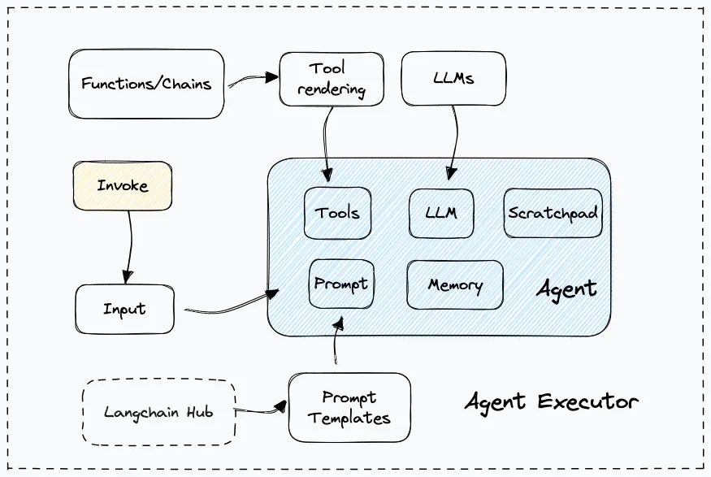

Construct an agent from strach generally involves the following modules
- Too creattion or loading: create custom tools or use build-in tools.
- Tool rendering: Present the tools to agent to be recoginized and used.
- Output Parser: Standarize the format of output response.
- Scratchpad formatting: Convert the content of "intermediate steps" into the proper format following the type agent.
- Prompt
- Memeory: track and store the chat history for the LLM to remember what is the context of this conversation
- Agent Executor: The runtime of agent

