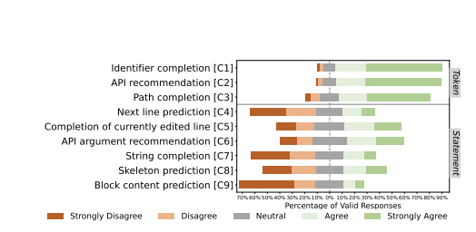
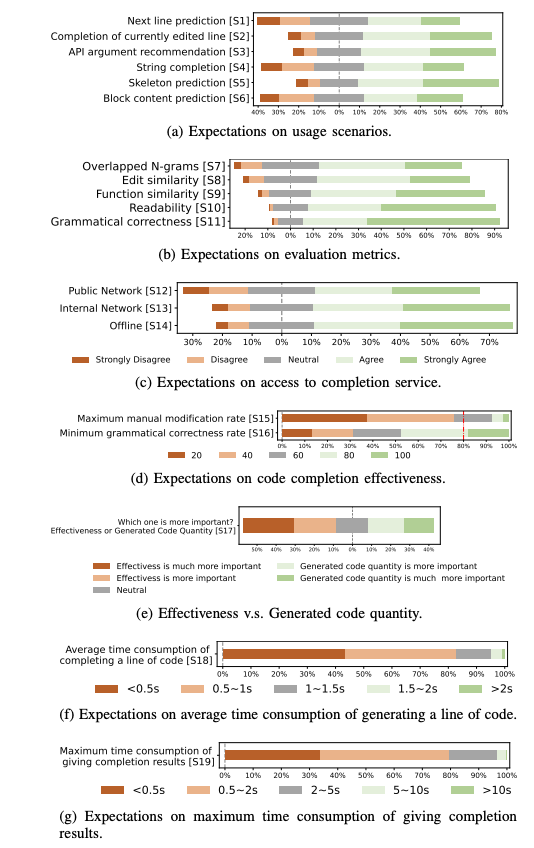

### Unit test
- [Adaptive Test Generation Using a Large Language Model](https://arxiv.org/abs/2302.06527)
- [Exploring the Effectiveness of Large Language Models in Generating Unit Tests](https://arxiv.org/abs/23
- [Automatic Code Completion](https://web.stanford.edu/class/archive/cs/cs224n/cs224n.1174/reports/2760954.pdf)
    - abstract syntax tree (AST), or just syntax tree
    - preprocessed the data by converting the program ASTs into their corresponding Left-Child Right-Sibling (LCRS) representations so that we can explore the tree structure in a binarized format.
- [A Static Evaluation of Code Completion by Large Language Models](https://www.researchgate.net/publication/371347016_A_Static_Evaluation_of_Code_Completion_by_Large_Language_Models)
    - Background: 
        -  execution-based evaluation is expensive, Although these benchmarks are highly reliable and accurate, they only focus on well-defined algorithmic and data science problems, which do not reflect the need in general software development
            -  HumanEval
            - MBPP
            - MBXP
            - CodeContests
            - DS-1000
        - static program analysis (or static analysis) can analyze programs without executing them. Although static analysis is usually unable to determine functional correctness, it covers a large collection of static error types, such as undefined names or unused variables 
        -  Static analysis tools such as linters have been widely used
    - Steps:
        -  Code snippets are first parsed into Abstract Syntax Trees (ASTs) and then analyzed by Pyflakes1, a popular static analysis tool for Python.
        -  collect code from public Github repositories to build a **function completion** dataset of 100K problems. In each problem, we **randomly mask out a function body** in a Python file and ask the model to complete it given the preceding context up until the function header
        - We then evaluate public models by sampling 10 completions for each problem, resulting in one million generations for each model and sampling temperature, which will be examined by our static evaluation pipeline
        - Function Completion: The author believe functions is the fundamental building blocks in programming, better serves. 
        - Single line completion: too short to reveal models'capability in writing syntactically correct code.
        - Software developers use code generation models as black-box services on a diverse set of codingprojects. To better simulate the real-world scenario, [my word]: need to generate real-word training samples and evaluation metrics by mimic the usage of code completion. 
        - treesitter to parse the whole file to identify all the functions.
        - Then a function that contains a docstring is randomly selected. The code from the beginning of the file up until the end of the docstring is used as the context, and the function body is considered as the groundtruth. The rest of the file is discarded
        - static analysis need the full set of code gor error analysis. 
        - edit similarity between model generation and groundtruth, and compare against Pass@1 from HumanEval (Chen et al., 2021) which is a popular execution-base
- [Practitioners’ Expectations on Code Completion](https://arxiv.org/pdf/2301.03846.pdf)
    - Abstraction
        - It aims at automatically predicting the next tokens or lines that the programmers tend to use. 
        - A good code completion tool can substantially save keystrokes and improve the programming efficiency for programmers
        - we perform an empirical study by first interviewing 15 practitioners and then surveying 599 practitioners from 18 IT companies about their expectations on code completion
        - builtin tools in IDEs are far more popular than third-party plug-in completion tools such as Copilot [11] and IntelliCode [8], used by 96% and about 13% of the participants
    - completion granularities: token level and statement level, (my word): block level or function level?
        - On average, 81% participants adopt token-level completion, which is evidently more than those adopting statementlevel completion (only 32%). For token-level completion, 84% and 85%. participants often utilize tools to complete identifiers and recommend APIs
        - For statementlevel completion, completing the currently edited line and predicting the API argument are the two most popular usage scenarios.
    - RQ3: What are practitioners’ expectations on code completion tools?
        - usage scenarios, evaluation metrics, access to service (online or offline), completion effectiveness, and efficiency
        - Most participants (85%) expect tools to generate token level completion results within 200 milliseconds.
        - For statement-level completion, the most expected scenarios are **skeleton completion** (predicting the skeleton of classes and methods), API argument recommendation (recommending the arguments of called APIs) and completion of currently edited line. The most favored completion latency is no more than 2 seconds
    - most papers measure overlapped n-grams and edit similarity between completed code and human-written code, however, they are not preferred by the majority of the participants.
    - 
    - 
    - 
    - 

## Better code assistant
- Need understand useage scenarios
- Proper training data, models, and evluation metrics. 