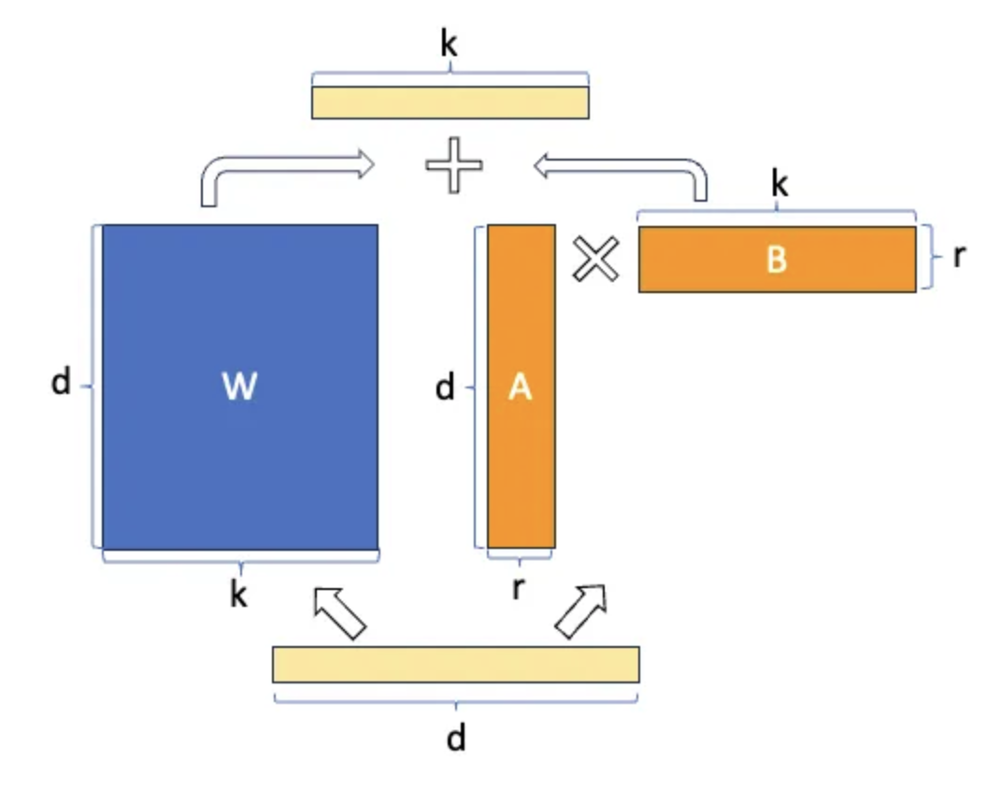

## Papers
- [LoRA Paper](https://arxiv.org/pdf/2305.14314.pdf)

## Learnings

- QLoRA: quantize base model into 4 bits, LoRa uses 8 bits
- LoRA and QLoRA parameter tunning [Databricks: efficient-fine-tuning-lora-guide-llms](https://www.databricks.com/blog/efficient-fine-tuning-lora-guide-llms):
    - Larger ranks could have a better performance, but model will slow/stop after certain threshold
    - Add more trainable layers could furture improve model performance, such as other linear layers
    - QLoRA use less memeory without reducing model performance.
    - `Alpaca format` data: 
        ```
        ### Instruction;
        xxx

        ### Response:
        xxx

        ### End
        ``` 
    - Modularity: You can build many small LoRA modules for different tasks. Load the same base model into memory and switch lora modules based on tasks.
