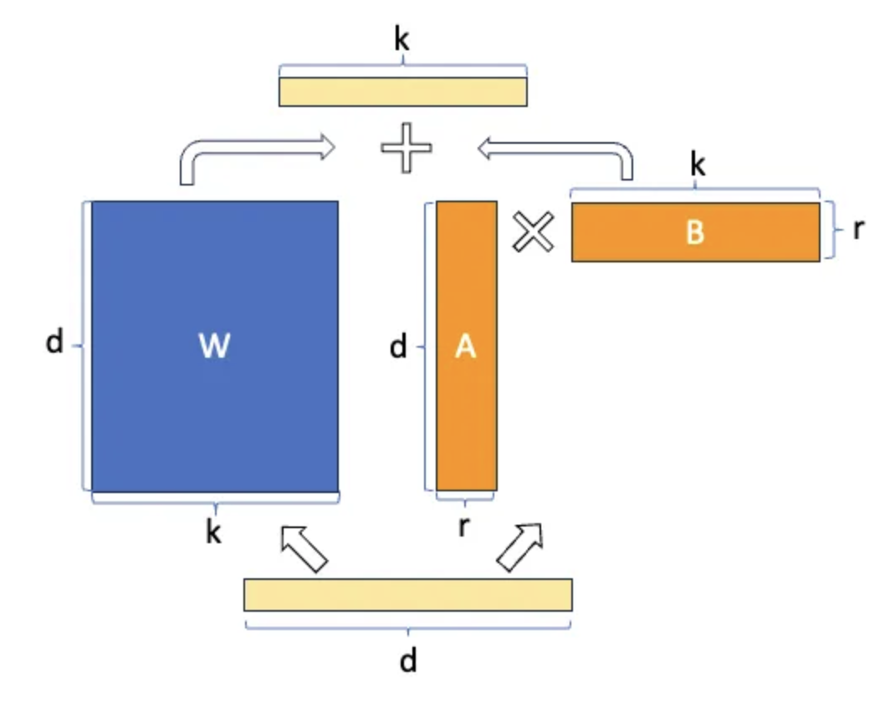
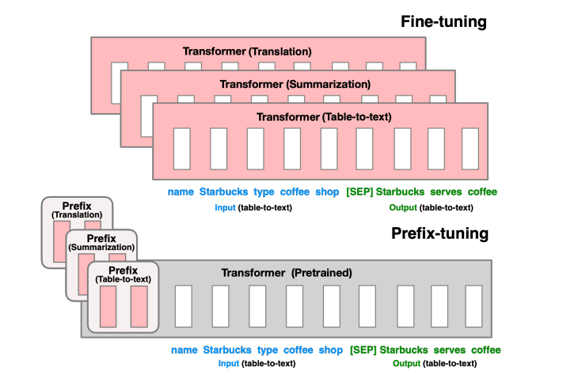

Finetue type
- Adpater Tunning: insert task specfic layers between each layers of the base model. 
- prompting: Prepend instructions and a few example to the task input and generating the tasl output from LM. 
    - In-context learning

## Papers
- [LoRA Paper](https://arxiv.org/pdf/2305.14314.pdf)
- [prefix tunning](https://aclanthology.org/2021.acl-long.353.pdf): add trainable continuous embeddings (also called continuous prompts) to the original sequence of input word
embeddings
- [Prefix v2](https://arxiv.org/pdf/2110.07602.pdf): add continuous embedding to every layer.

## Lora

- LORA Parameters:
    - r: rank. w(n*k) = A(n*r) * B(r*k). Original parameter:n*k, new number: n*r + r*k
    - taget_moudules
    - lora_alpha:  is the scaling factor that determines how much importance you want to give to the new updated ΔW i.e Wa×Wb when adding it to the original pretrained weights W
    - lora_dropout: 
- QLoRA: quantize base model into 4 bits, LoRa uses 8 bits
- LoRA and QLoRA parameter tunning [Databricks: efficient-fine-tuning-lora-guide-llms](https://www.databricks.com/blog/efficient-fine-tuning-lora-guide-llms):
    - Larger ranks could have a better performance, but model will slow/stop after certain threshold
    - Add more trainable layers could furture improve model performance, such as other linear layers
    - QLoRA use less memeory without reducing model performance.
    - `Alpaca format` data: 
        ```
        ### Instruction;
        xxx

        ### Response:
        xxx

        ### End
        ``` 
    - Modularity: You can build many small LoRA modules for different tasks. Load the same base model into memory and switch lora modules based on tasks.

## Prefix finetuning
- 
Prefix-tuning prepends a sequence of continuous task-specific vectors to the input, which we call a prefix, depicted by red blocks in Figure. To generate each token, the LM can attend to the prefix as if it were a sequence of “virtual tokens”, but unlike prompting, the prefix consists entirely of free parameters which do not correspond to real tokens.
    - Could leverage closed-source model, since we do not need to get access to model weights when fine tune it. 
    - See similar performance compared to finetune the whole model. 
- [P-Tuning v2](https://arxiv.org/pdf/2110.07602.pdf): appling continuous prompts for every layer of the
pretrained model, instead of the mere input layer

## Sparsity as a paradigm for LLM Dev: Less can be more 
our understanding of the human brain, and specifically the principle of sparsity in neural connections. Neurologically, our brains are teeming with neurons, but not every neuron is interconnected with each other. There exists a system of sparse connections that selectively activate during specific tasks or thought processes. This efficient design reduces energy consumption, prevents overstimulation, and allows the brain to handle immense amounts of information with limited resources.
